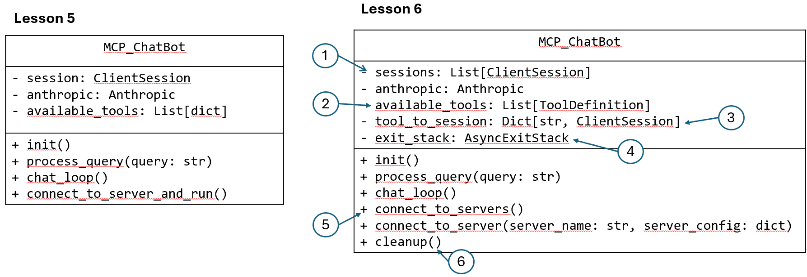

Below is a diagram of the updated MCP Chatbot with multiple clients and servers:

  1. Instead of having one session, you now have a list of client sessions where each client session establishes a 1-to-1 connection to each server;
  2. `available_tools` includes the definitions of all the tools exposed by all servers that the chatbot can connect to.
  3. `tool_to_session` maps the tool name to the corresponding client session; in this way, when the LLM decides on a particular tool name, you can map it to the correct client session so you can use that session to send `tool_call` request to the right MCP server.
  4. `exit_stack` is a context manager that will manage the mcp client objects and their sessions and ensures that they are properly closed. In lesson 5, you did not use it because you used the `with` statement which behind the scenes uses a context manager. Here you could again use the `with` statement, but you may end up using multiple nested `with` statements since you have multiple servers to connect to. `exit_stack` allows you to dynamically add the mcp clients and their sessions as you'll see in the code below.
  5. `connect_to_servers` reads the server configuration file and for each single server, it calls the helper method `connect_to_server`. In this latter method, an MCP client is created and used to launch the server as a sub-process and then a client session is created to connect to the server and get a description of the list of the tools provided by the server.
  6. `cleanup` is a helper method that ensures all your connections are properly shut down when you're done with them. In lesson 5, you relied on the `with` statement to automatically clean up resources. This cleanup method serves a similar purpose, but for all the resources you've added to your exit_stack; it closes (your MCP clients and sessions) in the reverse order they were added - like stacking and unstacking plates. This is particularly important in network programming to avoid resource leaks.
  